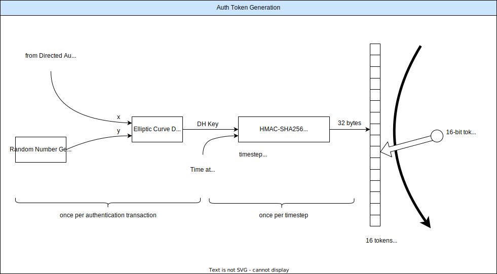
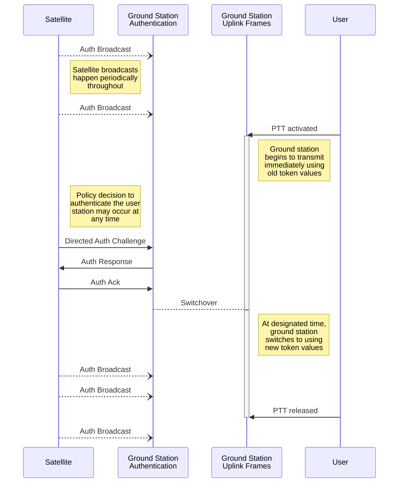

# Phase 4 Air Interface for User Authentication and Authorization

Proposal 2022-07-14 kb5mu. Comments and suggestions invited!

## Introduction

This is not the Air Interface Specification, despite the use of some standards-like language. This is a tutorial discussion of the design for AAAAA, albeit a rather detailed one, to facilitate understanding and discussion. Many more specific details and rules remain to be codified in the Air Interface Specification.

### Design Constraints and Goals

Recall some of our top-level design constraints and goals:

* Encryption may not be used "for the purpose of obscuring the meaning of any communication" per the FCC rules.

* The satellite must be able to limit use of the system to authorized stations according to a defined policy.

* The authorization policy is not standardized; each satellite owner is free to set the authorization policy it needs.

* Authorization policy can change from time to time. For example, there might be a stricter policy during communications exercises and emergencies. 

* The default authorization policy should be open access for all.

* The beginning of an uplink transmission should not generally be delayed for authentication.

* Since the uplink data rate available to a voice-class user is relatively limited, the overhead per uplink frame should be minimized.

* To the extent practical with low overhead, attempts to circumvent the authorization policy should be prevented.

### Top-level Design Principles

We adopt these design principles:
* A user is allowed to begin transmitting at any time. (open issues: channel allocation, congestion)

* Every individual uplink frame contains a station identifier and a short 16-bit authentication token. The token is designed to be difficult for an imposter to guess.

* The satellite is free to relay or discard uplink frames based on its own policies.

* Whenever policy requires that the actual identity of a station be confirmed, the satellite initiates an exchange of messages with that station to confirm its identity and re-initialize the stream of authentication tokens used in uplink frames.

### Cryptographic Mechanisms

Three fundamental mechanisms based on industry-standard cryptographic techniques are used:

1. User identity is confirmed using public-key certificates, which are validated against trusted root certificates known to the satellite. By default, for amateur radio purposes, these are ARRL Logbook of The World (LoTW) certificates tied to the station's government-issued callsign. This can be easily generalized to use other public key infrastructure(s) by loading different root certificates into the satellite. The transaction is initiated by the satellite whenever its policy dictates.

2. To create a secret that is shared between the satellite and the ground station, elliptic curve Diffie-Hellman key exchange is used. This transaction piggybacks on the certificate-based identity check, so that only the authenticated user can participate.

3. Based on this shared secret, a procedure similar to TOTP (Time-based One-Time Password with HMAC-SHA256) is used to generate the small 16-bit authentication tokens included in each frame. TOTP is familiar as the basis of programs like Google Authenticator and hardware "key fob" devices used for two-factor authentication on the web. This calculation takes a secret key and the time as inputs, and generates a code that is valid for a short period of time and "impossible" to predict without the secret key. Instead of using a six-digit human-friendly code derived from some chosen bits from the HMAC calculation as in TOTP, we use the entire 32-byte output of HMAC-SHA256, two bytes at a time, as tokens in the uplink frames.

Here's an illustration of the token generation procedure:

None of the core cryptographic techniques need to be coded. They are available in various open-source libraries. The OpenSSL library, for instance, includes all of them.

The only calculation that needs to be done in real time is the HMAC used to generate tokens for the uplink frames. This is very feasible. A quick benchmark using an open-source implementation of HMAC was able to run a test suite of dozens of HMAC calculations in just 3ms on a Raspberry Pi.

The certificate verification and Diffie-Hellman calculations can take as much time as necessary. The Air Interface will specify maximums.

## User Identity

We adopt from the M17 Project a BASE40 encoding scheme for amateur radio callsigns (and more). Six bytes are used to encode up to nine characters, which may be uppercase letters A-Z, digits 0-9, hyphens (-), slashes (/), or periods (.). This is probably enough to encode any government-issued callsign, plus most extra identifiers such as secondary station identifiers (the -1 through -15 used on AX.25 packet radio). There are also many, many 6-byte codes not used by this scheme. Some of them could be defined for future expansion of the name space. See the M17 protocol specification for details.

Each uplink transmission frame is identified with a user-selected __Claimed Identity__, which might be a decorated callsign like "KB5MU-15" or might be something else entirely, like "PAULW". This is how the station is addressed for routine purposes, and how its transmissions are identified in satellite broadcast messages listing channel usage.

In the authentication transaction, the station must provide both its __Claimed Identity__ and its __Actual Identity__ as proven by its validated public-key certificate. In the default case of LoTW certificates, the __Actual Identity__ is the station's government-issued callsign. It is up to the satellite's policy to decide whether the __Claimed Identity__ is required to have any particular resemblance to the __Actual Identity__. Typically, an amateur satellite would probably require that the __Claimed Identity__ contain the callsign unambiguously.

The __Claimed Identity__ strings are not truly anonymous, even if the satellite does not require them to unambiguously contain the ground station's callsign. The __Claimed Identity__ and __Actual Identity__ are transmitted together over the air on both uplink and downlink during the authentication transaction, so a continuously monitoring station can know the __Actual Identity__ for any __Claimed Identity__. On the other hand, a __Claimed Identity__ that does not include the ground station's callsign does not satisfy the regulatory requirement for station identification, so it would be up to the ground station to identify itself some other way at the proper interval (10 minutes under FCC rules).

## Satellite Broadcasts

The satellite periodically broadcasts various information of interest to ground stations. One of these broadcasts is the Auth Broadcast, which contains information the ground station needs to comply with the authentication and authorization mechanisms.

### Auth Broadcast

The Auth Broadcast is sent once per second.

| Field | Description |
|-------| ------------|
| Time Now | Current date+time to 40ms resolution |
| Sat ID | Unique identifier for this satellite |
| Diffie-Hellman p | Prime modulus p for Diffie-Hellman calculation, 2048 bits |
| Diffie-Hellman g | Base g for Diffie-Hellman calculation |
| Max repeats | Maximum number of consecutive frames that may use the same token |
| Min repeats | Minimum number of consecutive frames that may use the same token |

Time Now is sent to inform the ground station of any offset between its own clock and that of the satellite. The ground station may need to take propagation delay into account.

Sat ID is sent to avoid confusion in case multiple satellites are available.

The p and g parameters for Diffie-Hellman must be agreed between the parties for the algorithm to work.

Computing a new token for every single frame is probably feasible for the ground station, but it may put an undue burden on the satellite, which has to compute it for every user in order to authenticate every frame. We allow the ground station to name a repeat count, within the maximum and minimum limits in the Auth Broadcast. Each computed 16-bit token is used for that many consecutive frames. If the repeat count is equal to 1, there is no window of time during which an attacker might hijack the uplink by waiting for the legitimate station to transmit the token and then overpowering the legitimate signal to transmit its own message. As the repeat count increases, the window of vulnerability opens up, but the computational cost of maintaining authentication goes down.

The repeat count in use also implies the time step used with the HMAC. With repeat count equal to 1, the HMAC must be refreshed every 16 frames (640ms), since each iteration of the HMAC calculation produces 32 bytes and each frame uses up two bytes. For repeat count R, the HMAC must be refreshed every R*16 frames. In keeping with TOTP practice, the time value going in to the HMAC calculation is in units of the refresh period, called the _time step_.

The vulnerability described above requires the attacker to be located in close proximity to the legitimate ground station, in order to receive the token being transmitted on the uplink. This is a somewhat unlikely scenario, so for most ground stations, there is no real need to change the token every frame. A high value of _Max repeats_ allows most ground stations to update the HMAC less often, while still allowing any specific ground station that has a problem with a nearby attacker to update HMAC very often in exchange for lower vulnerability.

## The Authentication Transaction

This diagram illustrates a ground station transmission during which the satellite decides to initiate an authentication transaction. The details of each message are in the next section.

The satellite is constantly transmitting the Auth Broadcast, once per second.

At some arbitrary time, the user of the ground station chooses to transmit (shown here as __PTT__ for push-to-talk). The ground station immediately begins to transmit frames, such as Opulent Voice frames. It fills the token fields in these frames with the appropriate values according to its most recent authentication transaction with the same satellite. If no previous authentication state is available, it fills the token fields with zero.

The satellite may accept these frames without performing any additional authentication, if its policy permits, for as long as its policy permits. The ground station is required to monitor the downlink. If the ground station sends frames that require a response from the satellite and does not receive any for TBD period of time, or if it sends frames it expects to be relayed on the downlink and does not receive any for TBD period of time, it may increase uplink power (if possible) and try again, up to the maximum time and uplink ERP allowed. If there is still no response from the satellite, the ground station must cease transmitting.

At any time, the satellite policy may decide to perform an authentication transaction for a specific station. It initiates the transaction by sending a Directed Auth Challenge, addressed by the __Claimed Identity__ of the station to be authenticated. This message contains several transaction-specific numbers that the ground station needs to complete the transaction.

The ground station uses the numbers from the Directed Auth Challenge to compose a Signed Message, which echoes back some satellite-provided numbers and adds some additional numbers created by the ground station. It then signs the Signed Message using private key corresponding to its public-key certificate. It then composes and sends to the satellite's authentication address an Auth Response message, which contains those elements of the Signed Message not already known to the satellite, the signature of the Signed Message, and a copy of the ground station's public-key certificate.

Upon receiving the Auth Response message, the satellite should validate the certificate using trusted root certificates pre-programmed into the satellite. If this validation passes, the satellite reconstructs the Signed Message by combining values from the Directed Auth Challenge and the Auth Response. It should then use the certificate to check the validity of the Signed Message. It should check the __Actual Identity__ in the Signed Message against the identity in the ground station's certificate. If policy requires, it should check the __Claimed Identity__ in the Signed Message against the __Actual Identity__. It should perform any additional validity checks on other fields of the Signed Message. Finally, it should make a determination about the status of this station's authorization.

The satellite then transmits an Auth Ack message to the ground station, containing the result of the authorization decision. In the normal case, in which the ground station is authorized to continue using the satellite, the Auth Ack message also contains a __switchover__ time in the near future when the newly-computed authentication state is to take effect. TBD, this message may also contain guidance about which uplink channel(s) the ground station is to use.

If the satellite determines that the ground station is not to continue transmitting at this time, it supplies a reason code in the Auth Ack message. If the satellite believes that a further attempt to authenticate the ground station might be helpful, it may begin a new authentication transaction by sending a new Directed Auth Challenge.

If the ground station does not receive a timely Auth Ack, it may retry the Auth Response.

If the ground station does receive an Auth Ack allowing it to proceed, it continues to transmit frames with the old tokens until the __switchover__ time arrives. At that time, it begins to use tokens computed according to the newly agreed values (and, TBD, possibly switches to a new channel assignment).

## Authentication Transaction Messages

### Directed Auth Challenge

| Field | Description |
|-------| ------------|
| challenged __Claimed Identity__ | The __Claimed Identity__ of the station being challenged. This is available from every uplink frame if the satellite is receiving an unknown station.
| challenge ID | A number identifying this challenge transaction.
| challenge bits | A large random number providing security to the Signed Message.
| Diffie-Hellman X | The satellite's computed value for the Diffie-Hellman key agreement.

The Directed Auth Challenge is sent whenever the satellite wishes to initiate an authentications transaction. This need not be during an uplink transmission.

If no response is received, the satellite is free to retry the Directed Auth Challenge, or not, according to policy. It is also free to stop accepting the ground station's frames.

### Signed Message

| Field | Description |
|-------| ------------|
| Sat ID | The satellite ID (taken from the Auth Broadcast)
| Claimed Identity | The __Claimed Identity__ of the ground station. Should match the challenged __Claimed Identity__ from the Directed Auth Challenge.
| Actual Identity | The __Actual Identity__ of the ground station. Should match the ground station's certificate.
| challenge bits | The challenge bits from the Directed Auth Challenge.
| Diffie-Hellman Y | The ground station's computed value for the Diffie-Hellman key agreement.
| Actual repeats | The number of consecutive frames to contain the same token value.

The Signed Message is never transmitted. It is formulated by the ground station and signed.

### Auth Response

| Field | Description |
|-------| ------------|
| Sat ID | The satellite ID as in the Signed Message
| Claimed Identity | The __Claimed Identity__ as in the Signed Message
| Actual Identity | The __Actual Identity__ as in the Signed Message
| challenge ID | The challenge ID from the Directed Auth Challenge
| Diffie-Hellman Y | The Diffie-Hellman Y as in the Signed Message
| Actual repeats | The actual repeats as in the Signed Message
| Signature | The signature of the Signed Message
| Certificate | The ground station's public-key certificate

The Auth Response contains enough of the fields from the Signed Message to enable the satellite to reconstruct the complete Signed Message.

### Auth Ack

| Field | Description |
|-------| ------------|
| Claimed Identity | The __Claimed Identity__ of the ground station.
| Actual Identity | The __Actual Identity__ of the ground station.
| challenge ID | The challenge ID from the Directed Auth Challenge.
| Result | The authorization result for the ground station (see below)
| Switchover | The __switchover__ time, when the new authentication tokens take effect
| TBD | (There might be some channel assignment fields here)
| Wait duration | If the result code is WAIT, this says how long.
| Explanation | Free text from the satellite.

The Auth Ack message completes the authentication transaction. The result codes are as follows:

| Result Code | Description |
|-------------|-------------|
| WELCOME | The ground station is authorized to continue transmitting.
| INVALID | Some aspect of the Auth Response is unacceptable to the satellite.
| REAUTH | The satellite wishes to retry the authentication transaction.
| SYSTEM CLOSED | The satellite is not accepting user transmissions at this time.
| WAIT | The ground station must stop transmitting for the Wait duration.

If the result code is REAUTH, the ground station should stop transmitting and stand by to receive a new Directed Auth Challenge.

If the result code is WAIT, the ground station should stop transmitting and not resume for at least the Wait duration.

The satellite may put any kind of text in the Explanation field. In any case other than WELCOME, this text should explain what the problem seems to be.
