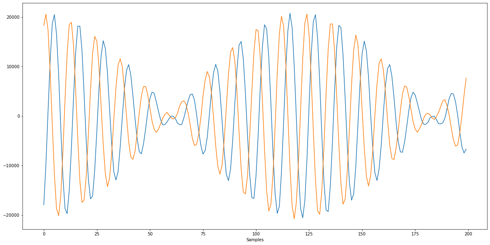
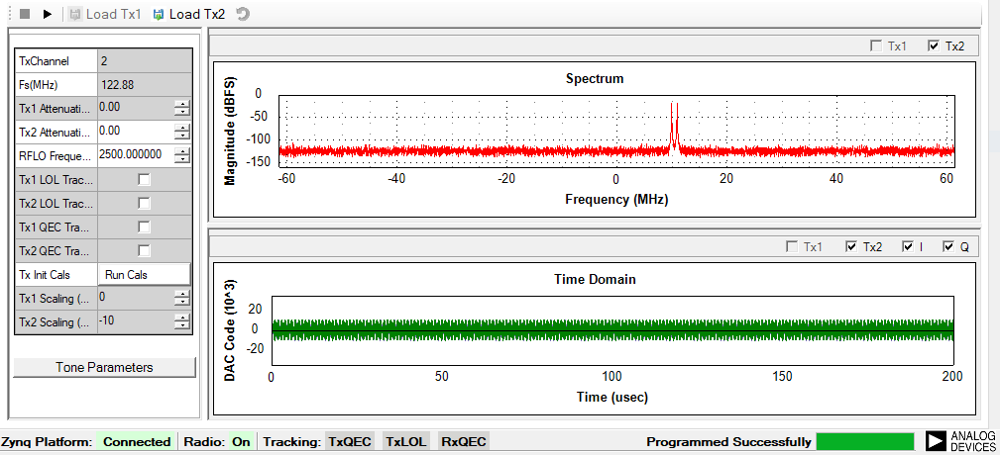

# Lab Report: Tracing TES Interaction with ZC706+ADRV9371

2021-12-28 Paul Williamson KB5MU

Michelle and I wanted to learn about how TES (the Windows-only GUI Transceiver Evaluation Software from Analog Devices) interacts with the target hardware and software.

The first thing we learned by experiment is that TES is not compatible with the standard ADI kernel and the Kuiper Linux distro that goes with it. It apparently uses a whole different API to interact with a host. Instead of Kuiper, there's a separate SD card image, which can be downloaded from the same ADI web page as TES itself. It's a somewhat smaller image (about 1.6GB zipped, almost 8GB on the card) based on Linaro. We will need to figure out how this image relates to the Kuiper image and which we should pursue for our own development.

Since the TES GUI runs on Windows, it does not run on the target hardware at all. It doesn't need any special connections to the target, either. It just needs an Ethernet connection. We installed TES on the main Windows VM on Chonc, known as Chonc-Win10.

Since the connection is just Ethernet, I monitored the link by capturing packets using Wireshark on the same VM. TES was already running and connected to the target. I started the packet capture, then clicked the _play_ button to transmit a few seconds of a two-tone test signal, clicked the _stop_ button to end the transmission, and finally ended the capture. I was expecting to see sample data streaming from TES to the target throughout the several seconds of transmitting. But that’s not what I saw.

All the interactions between TES and the target were carried in a single TCP connection. Wireshark makes it easy to look at just the data conversation in a single TCP session. The first thing I noticed was that some of the interactions were actually human-readable (in ASCII). For instance, when the target was idle, there was a constant slow status poll that looked like this:

```
runapifunction MYKONOS_getRadioState
3
runapifunction MYKONOS_getRadioState
3
runapifunction MYKONOS_getRadioState
3
```

`MYKONOS` there is the ADI internal code name for the AD9371.

The first few commands after I clicked _play_:

```
FpgaWrite 14,18
OK
FpgaWrite 14,0
OK
FpgaWrite 400,200
OK
runapifunction enableTxDataPaths,0
OK
writeram tx2,0,98304
536870912,98304
```

I assume these FpgaWrite commands would make sense if compared to the AXI registers implemented by the bitstream loaded into the FPGA.

The writeram command was especially interesting. It was followed by a binary dump from TES to the target of exactly 96k bytes (that is, 98304 bytes) over the next 75 milliseconds. That size caught our eye, because that's exactly the same size as the executable image the tools download into the embedded ARM processor on the ADRV9371 transceiver board.

After the 96k data dump, these messages were seen:

```
OK
runapifunction setTxTransmitSamples,TX2_DM,536870912,98304
OK
runapifunction enableTxDataPaths,128
OK
runapifunction setTxTransmitMode,1
OK
runapifunction startTxData
OK
FpgaRead 200
00000086
FpgaRead 21C
98000000
FpgaRead 220
00008000
FpgaRead 224
A0000000
FpgaRead 228
00018000
FpgaRead 400
00000200
FpgaRead 428
00000319
FpgaRead 42C
83000000
FpgaRead 430
8D011F00
FpgaRead 434
0080202F
FpgaRead 200
00000086
FpgaRead 22C
0000000C
runapifunction MYKONOS_getRadioState
3
runapifunction MYKONOS_getRadioState
3
```

... and the _MYKONOS_getRadioState_ polling continued until the end of the packet capture.

I didn't look too closely at the commands after the data dump. Instead I followed up on my suspicion that it was the ARM image. I got Wireshark to output the data in raw format and brought it into a hex editor to examine more closely. Not seeing any pattern, I asked Michelle to read off a few bytes of the ARM image file so I could find a match in the data dump. There was no match. In fact a glance at the ARM image hex dump was enough to confirm right away that it wasn't anything like the captured data dump.

The only other explanation I could think of for the data dump was that it contained sample data. I wrote a little Python code in a Jupyter notebook to check out that theory. I found a hint in some example source code that the sample data would be in 16-bit signed integer format, so that's what I tried.

```Python
# Read in the captured TCP stream bytes sent from TES to ZC706 when transmitting two tones
with open("/Users/kb5mu/Desktop/capture-words.bin", mode='rb') as file: # b is important -> binary
    fileContent = file.read()

# Interpret the data as 16-bit signed integers
words = [fileContent[i:i+2] for i in range(0, len(fileContent), 2)]
samples = [int.from_bytes(x, "big", signed=True) for x in words]

# Assume that every other word is I, then Q, etc.
i_samples = samples[0:-1:2]
q_samples = samples[1:-1:2]

import matplotlib.pyplot as plt
plot_size = 200
plt.rcParams['figure.figsize'] = [20,10]
time = range(0,plot_size)
plt.plot(time, i_samples[1:plot_size+1])
plt.plot(time, q_samples[1:plot_size+1])
plt.xlabel('Samples')
plt.show()
```

And here's the result:



That's sample data! The graph shows only the first 200 samples, but even the full data dump doesn't contain enough samples to fill up the whole transmission of several seconds. At the default sample rate of 122.88 MHz, it's exactly 200 microseconds worth of samples. Which just happens to be the extent of the time axis shown on the TES screen visualizing the transmission.



I assume this 200us buffer is played out repeatedly to fill the indefinite duration of the transmission. I don't know whether TES has done anything clever to make the transition seamless. Probably they just accept a phase glitch every 200us. It would be interesting to find out.

If we now go back and look more carefully at the commands that came after the data dump, we can find confirmation of our discovery:

```
runapifunction setTxTransmitSamples,TX2_DM,536870912,98304
```

That seems to be a command to treat the data from the writeram command (at address 536870912, which looks nicer in hex: 0x2000 0000) as the transmit samples.

So far the only documentation I've been able to find for this set of commands is in the Help menu of TES, under the name `DLL Help File`. Unfortunately, this is only Doxygen output, not real documentation, and it describes the DLL classes and methods, not explicitly the protocol.
